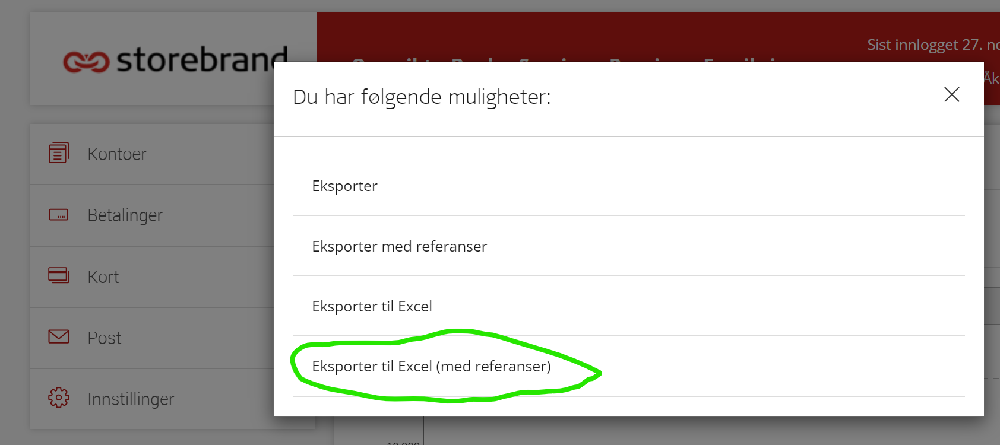
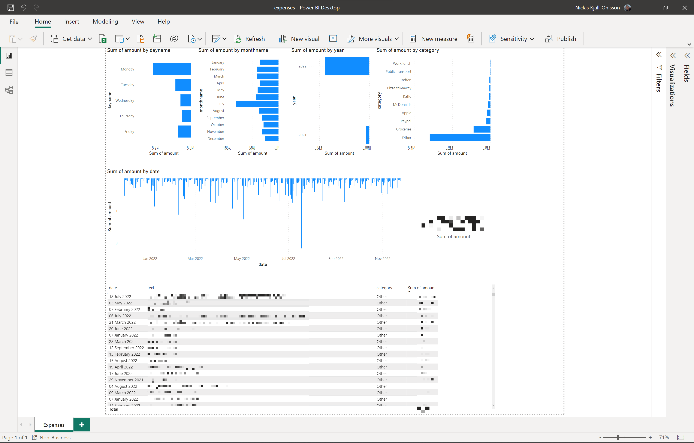

## Personal Finance Analytics

<b>NOTE:</b> This solution requires Power BI. Download from https://powerbi.microsoft.com/en-us/downloads/. Also, this solution is based on transaction data from the Norwegian bank Storebrand so assumes you are a bank customer with them.

1. Setup repo:
    ```.\setup.bat```
2. Activate virtual environment:
    ```.\.env\Scripts\activate```
3. Download transactions as Excel files from your accounts at https://nettbank.storebrand.no/. Save to ./artefacts/data
    
4. cd ./scripts
5. Prepare data for dashboard:
    ```python .\prepare_data.py```
6. Open the Power BI template file ./powerbi/expenses.pbit
7. Enter absolute path to ./artefacts/exports when prompted.
8. Finally you should see your dashboard:
    